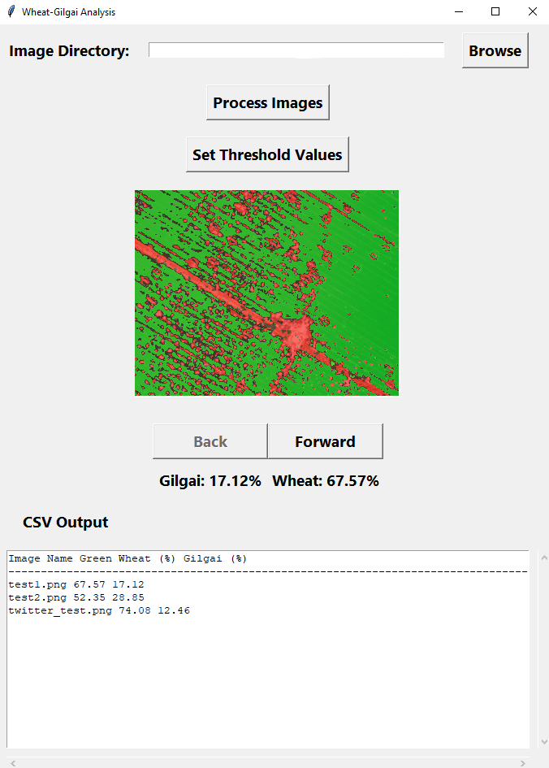
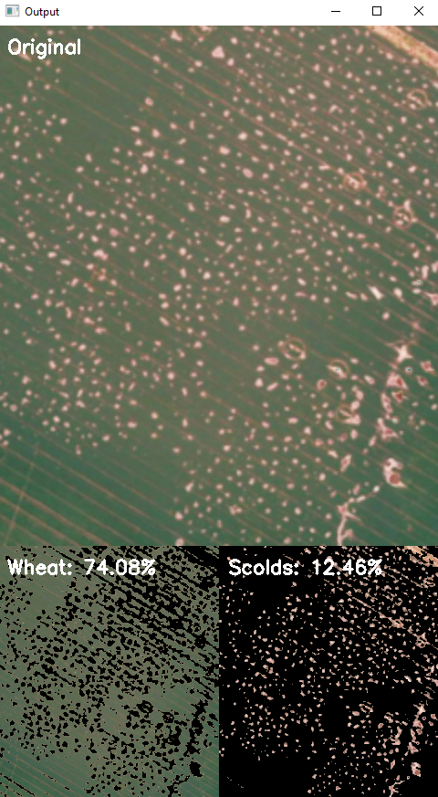

# Calculating percentage Gilgais in a Paddock
Using this thread on Twitter for inspiration, the repository was made to allow a user to threshold images and 
determine the area of an image that is from gilgais or a 'wheat' or other crop. Using ChatGPT, a GUI is now a
fairly user-friendly way of operating it.

## A Tkinter-based user interface
Clone this repository, install the requirements (numpy and OpenCV) and then run `python gui.py` 
on your command line. It should bring up a window like the one below. There are default colour settings included
in the `parameters.json` file, but if you want to change those, you'll need to run `gilgai_detection.py` separately.

Once it is open, select the directory of images you would like to process, click process. It will save the percent cover
of each to a csv file and display a segmented image. You can toggle between the images using the Back/Forward 
buttons.

## Non-GUI based

This example of Gilgai 'detection' uses simple HSV thresholding for wheat and Gilgai/non-wheat areas with OpenCV and numpy. 
The percentage cover of each class in the image is calculated using total pixels in the image and displayed 
on the image. 

When the windows are closed with 'Q' the slider values are saved and will be loaded on reopening. Use the `gilgai_detection.py`
file to set and store the values first and then the `process_directory.py` file to use the stored values to process and
save the results from an entire directory to CSV.
