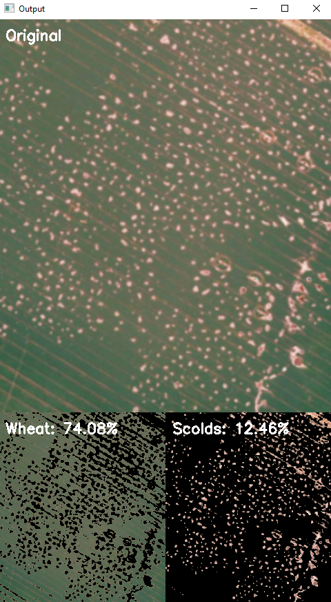

# Calculating percentage Gilgais in a Paddock
This example of Gilgai 'detection' uses simple HSV thresholding for wheat and Gilgai/non-wheat areas with OpenCV and numpy. 
The percentage cover of each class in the image is calculated using total pixels in the image and displayed 
on the image. 

When the windows are closed with 'Q' the slider values are saved and will be loaded on reopening. Use the `gilgai_detection.py`
file to set and store the values first and then the `process_directory.py` file to use the stored values to process and
save the results from an entire directory to CSV.
